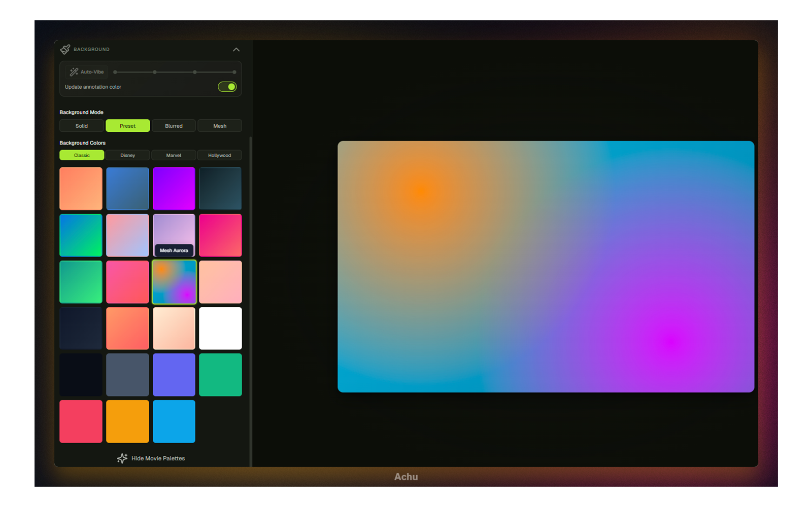
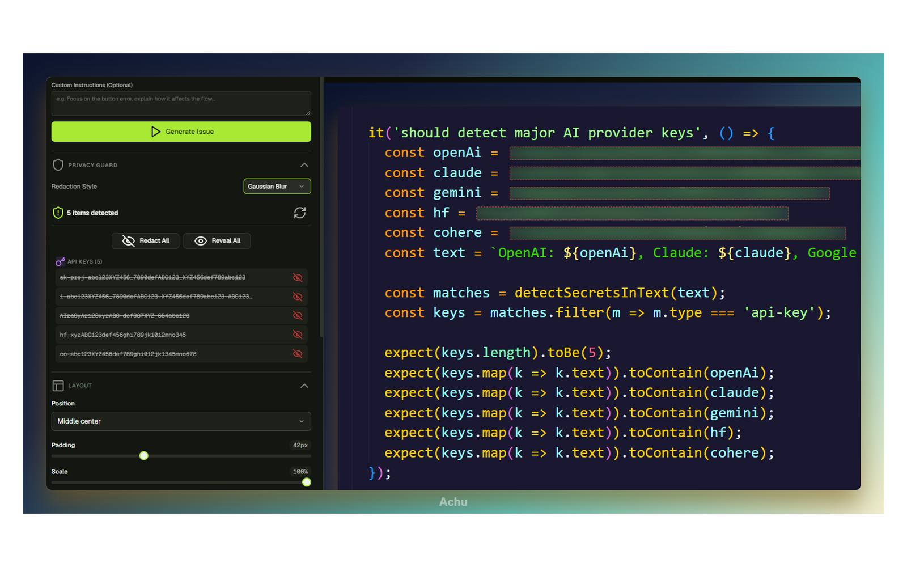
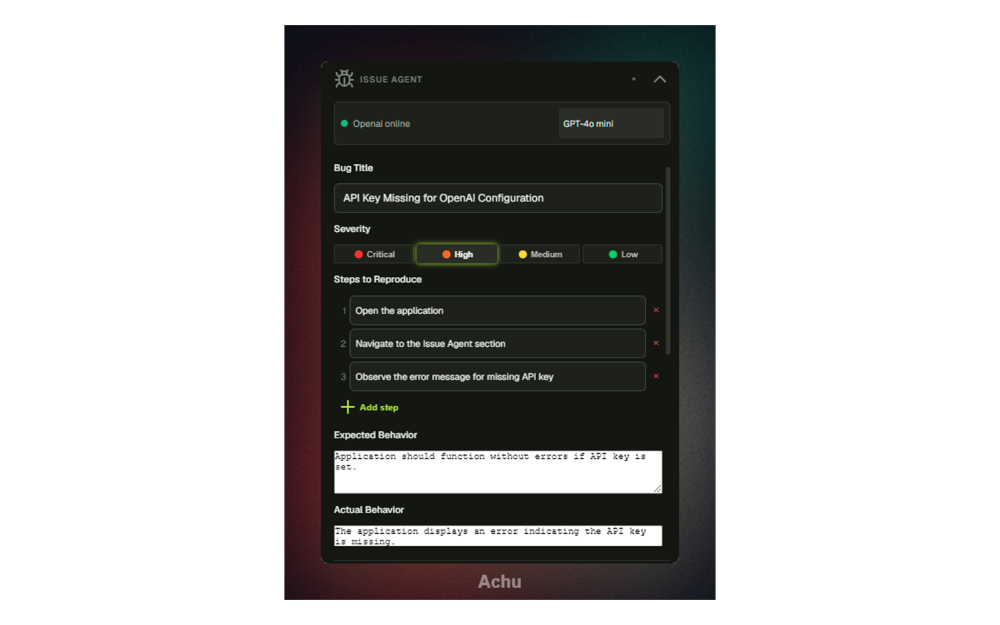
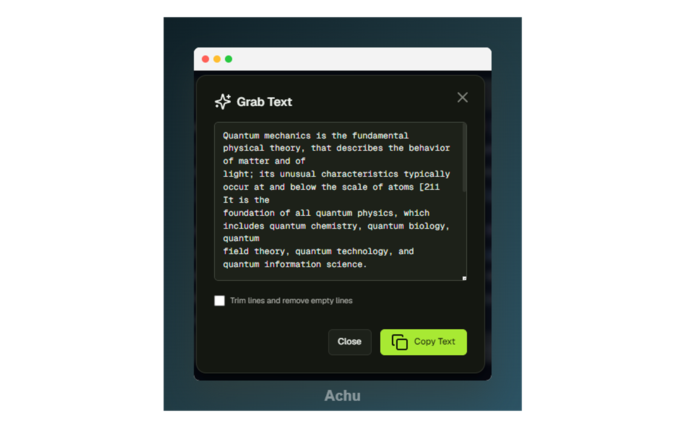

<p align="center">
  
</p>

<p align="center">
  
</p>

<p align="center">
  <strong>A lightweight, gorgeous desktop utility for Windows, macOS, and Linux that turns raw screenshots into polished visual assets.</strong>
</p>

<p align="center" style="font-size: 1.1em; color: #64748b;">
  achu (அச்சு) means `print` in Tamil. 🖨️
</p>

<p align="center">
  
  
  
  
  
  
  <br />
  
  
  
  
</p>

---

## 📸 Screenshots & Showcase

| 🎨 Canvas Beautification & Presets | 🛡️ Privacy Guard & Redaction |
| :---: | :---: |
|  |  |
| **🤖 AI Issue Agent Integration** | **🔍 OCR Text Extraction** |
|  |  |

---

## ✨ Features

### 🎨 Canvas & Framing Aesthetics
* **Beautification Layouts:** Frame screenshots with custom padding, background blur, rounded corners, adjustable shadows, scale, and custom aspect ratios.
* **Fluid Mesh Gradients:** Generate premium multi-point mesh gradients for background wrappers, along with linear/radial gradients and solid colors.
* **Browser Chrome Overlays:** Instantly add polished browser mockups (macOS-style or Windows-style window controls) around your screenshots.
* **Aspect Ratio Presets:** Quickly format your graphics for popular social platforms like Twitter/X, LinkedIn, and Product Hunt.

### 🛡️ Smart Privacy Guard
* **Auto-Scanning:** Scans screenshots locally using Tesseract WASM to automatically detect credentials, API keys, passwords, credit card numbers, email addresses, IP addresses, phone numbers, and physical locations.
* **Pixel-Perfect Redaction:** Toggle visibility for individual detected items or redact all with one click.
* **Gaussian Blur & Solid Masks:** Choose between soft Gaussian Blur or clean 100% Solid Color masks.
* **PNG Integrity:** Suggests exporting to PNG format for redacted captures to ensure deleted/masked pixel values are completely scrubbed and unrecoverable.

### 🤖 AI-Powered Issue Agent
* **Automated Bug Reporting:** Uses vision models to analyze your screenshot and generate full GitHub issue templates (titles, tags, reproduction steps, and system context).
* **Multi-Provider AI support:** 
  * **Ollama (Fully Offline):** Run models locally (e.g., `llava-phi3`) with no external data leaks.
  * **Google Gemini:** `gemini-2.5-flash`
  * **OpenAI:** `gpt-4o-mini`
  * **Anthropic Claude:** `claude-3-5-sonnet-latest`
* **Direct GitHub Integration:** Connect your repository and push the generated issue reports directly to GitHub.

### 🔍 OCR Canvas Text Grabber
* **Right-Click OCR:** Right-click anywhere on the canvas screenshot to extract text content instantly.
* **Grab Text Modal:** Edit, trim, format, and copy the extracted text to your clipboard.
* **100% Private:** Runs Tesseract OCR in-browser via WebAssembly, performing text extraction locally on your machine.

### 🖊️ Rich Vector Annotations
* **Drawing Tools:** Annotate screenshots using rectangles (filled/outline), ovals (filled/outline), straight lines, arrows, freehand pen, custom text fields, and emojis.
* **Full Object Control:** Move, resize, delete, and re-order drawn annotation layers.
* **Deep Edit History:** Full support for multi-step Undo (`Ctrl+Z`) and Redo (`Ctrl+Y`) operations.

---

## ⌨️ Keyboard Shortcuts

| Shortcut | Description |
| :--- | :--- |
| **`Ctrl` + `V`** / **`Ctrl` + `Alt` + `V`** | Paste image from Clipboard |
| **`Ctrl` + `Z`** | Undo last action |
| **`Ctrl` + `Y`** | Redo last action |
| **`Ctrl` + `Shift` + `S`** | Copy beautified snap to clipboard |
| **`Delete`** / **`Backspace`** | Delete selected annotation object |
| **`V`** or **`1`** | Select / Move Tool |
| **`R`** / **`Shift` + `R`** / **`2`** / **`3`** | Rectangle Tool (Outline / Filled) |
| **`C`** / **`O`** / **`Shift` + `C`** / **`4`** / **`5`** | Circle / Oval Tool (Outline / Filled) |
| **`L`** / **`A`** / **`6`** / **`7`** | Line / Arrow Tool |
| **`T`** / **`P`** / **`8`** / **`9`** | Text / Freehand Pen Tool |
| **`E`** / **`0`** | Add Emoji Tool |

---

## 🚀 Getting Started

### Prerequisites
* **Node.js** 18 or higher
* **npm**

### Installation
1. Clone the repository:
   ```bash
   git clone https://github.com/QAInsights/achu.git
   cd achu
   ```

2. Install dependencies:
   ```bash
   npm install
   ```

3. Launch development mode with Hot Reload:
   ```bash
   npm run dev
   ```

---

## 🛠️ Build & Package

achu uses `electron-builder` to package lightweight native binaries for Windows, macOS, and Linux.

| Script | Action | Output / Description |
| :--- | :--- | :--- |
| `npm run build` | Compile code | Generates optimized production bundles in `app-bundle/` |
| `npm run test` | Run tests | Runs unit and rendering tests using `Vitest` |
| `npm run test:coverage` | Coverage | Generates a coverage report via `v8` |
| `npm run package` | Pack App | Builds production bundles and packages portable packages in `release/` |

* **Windows Target:** Standalone portable `.exe` executable (x64 / arm64).
* **Linux Target:** Standalone AppImage and `.deb` packages.
* **macOS Target:** Standalone `.dmg` disk image and `.zip` archives.

---

## 🔒 Security & Privacy

* **Local OCR & Secrets Scanning:** Tesseract WASM scans and extracts your screenshot text strictly locally inside the Electron sandbox. No images or text are sent to third parties during OCR or Privacy Guard runs.
* **Secure Token Storage:** All external AI keys and GitHub API tokens are stored using Electron's native [safeStorage API](https://www.electronjs.org/docs/latest/api/safe-storage), which encrypts credentials on disk using operating-system-level cryptography (Keychain on macOS, DPAPI on Windows, and Secret Service/KWallet on Linux).

---

## ☕ Support & Community

If you find achu useful, consider supporting development or checking out QAInsights resources:

* **Sponsor & Donate:** [Buy Me a Coffee](https://buymeacoffee.com/qainsights)
* **License:** MIT License. See [LICENSE](./LICENSE) for details.
